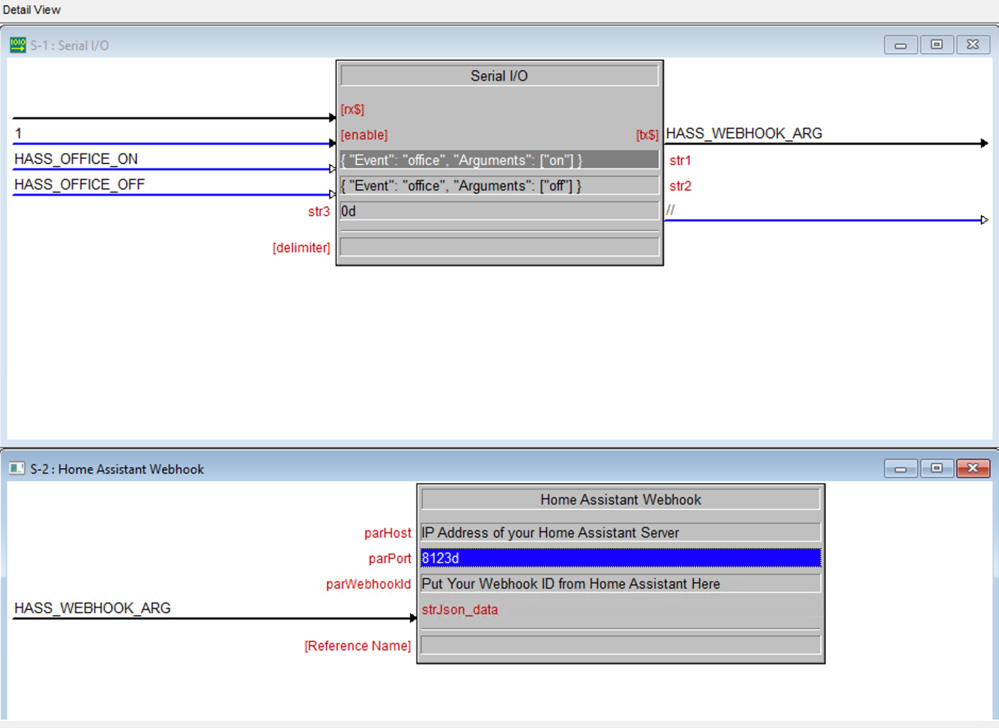
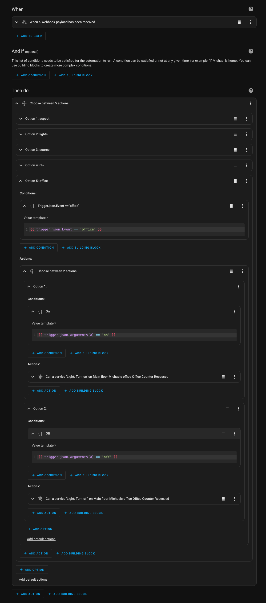

# Crestron-Home-Assistant-Webhook
Crestron SIMPL+ module for invoking a Home Assistant webhook with JSON arguments

### Installation
Copy the two files `Home Assistant Webhook.usp` and `Home Assistant Webhook.ush` to your configured `SIMPL User Modules folder` (see: Options -> Preferences -> Directories ). The default location is `C:\Users\Public\Documents\Crestron\SIMPL\Usrmacro`.

### Give us some love
If you use this module in a Crestron project please give it a Star. :star:

## Usage

1. Configure the three parameters:

| Parameter | Description                                      |
| :---      | :--- |
| `parHost` | Host or IP address of your Home Assistant Server |
| `parPort` | IP port for your Home Assistant Server. Usually 8123 or 80. |
| `parWebhookId` |  Comes from Home Assistant when building a Webhook Automation |

2. Drive the Serial `strJson_data` signal with the JSON value you wish to have `POST`ed to the Home Assistant Webhook.

## Example Home Assistant Webhook Automation
